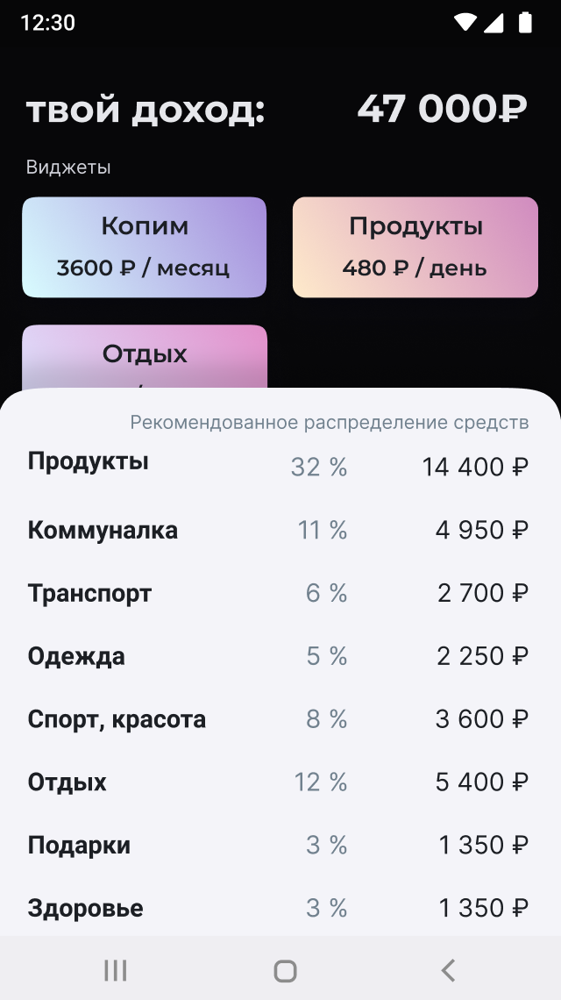

## Moneymap

Financial app for the lazy
by [concept](https://www.figma.com/file/FjvhOfJJbaFBtRYMcJVnHm/%D0%94%D0%B5%D0%BD%D1%8C%D0%B3%D0%BE%D0%BF%D0%BB%D0%B0%D0%BD?node-id=0%3A1)
.  

### Download [`Moneymap for Android`](https://github.com/reactivedevelopment/moneymap/releases).

### How to build `Moneymap` from source code?

Run command `./gradlew assembleBeta` in the repo. Your app will be located
at `./app/build/outputs/apk/beta`

### What technologies were used in this project?

* [`Kotlin`](https://kotlinlang.org/) programming language.
* [`Android SDK`](https://developer.android.com/studio).
* [`Jetpack Compose`](https://developer.android.com/jetpack/compose) UI toolkit.
* [`Gradle`](https://gradle.org/) build system.
